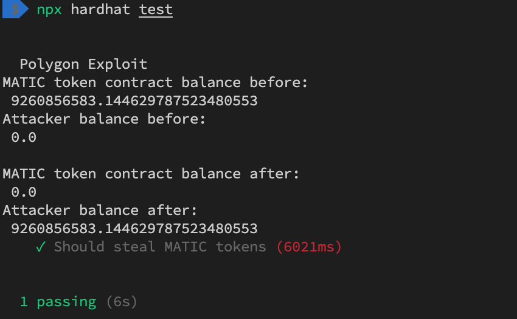

# This project demonstrates a PoC for the Polygon lack of balance check vulnerability

This example uses MRC20 as target vulnerable token as the victim which contains ~9260856583.14 MATIC.

A prequisite of running this PoC is setting the POLYGON_ALCHEMY_API_KEY environment variable.

```
export POLYGON_ALCHEMY_API_KEY=https://polygon-mainnet.g.alchemy.com/v2/[API_KEY]
```

